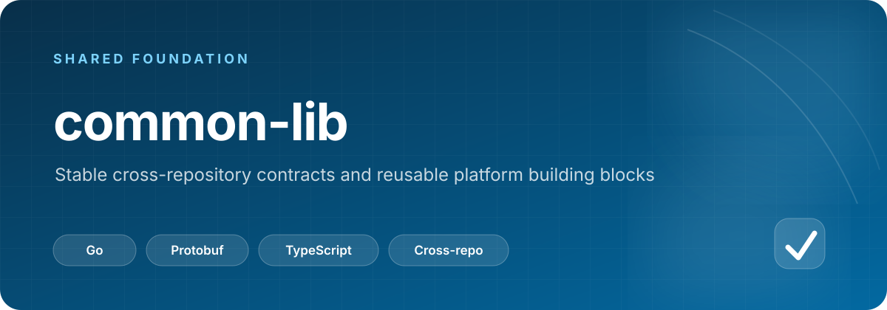

# common-lib

<p align="center">
  
</p>

<p align="center">
  
  
  
  
</p>

<p align="center"><a href="#生成">生成命令</a> · <a href="proto/byte/v/forge/contracts/">公开契约</a> · <a href="ui/">共享 UI</a></p>

## 一眼看懂

| 维度 | 说明 |
| --- | --- |
| 定位 | 跨仓稳定公开契约与无业务语义的通用 helper |
| 唯一契约源 | `proto/byte/v/forge/contracts/` |
| 主要消费端 | Go 生成物、TypeScript 类型，以及按需生成的 Python SDK |
| 公开边界 | 只暴露状态投影与 capability；密码、Token、Cookie 和 provider 原始结构留在业务内部 |
| 变更原则 | 稳定、跨域、可复用的能力进入本仓；具体业务状态机继续归业务仓所有 |

---


跨仓平台通用库：

- `proto/byte/v/forge/contracts/`：公开 proto 契约唯一源头，只放跨仓稳定公开建模和 gRPC service；内部/private/provider 细节不得进入本目录。
  公开资源只暴露状态投影和 capability，不能暴露 password、token、cookie、provider raw shape 等可复用 secret；例如 mailbox 公开模型只提供 `credential_state`，真实凭据留在 mailbox 内部契约和存储。
  `contracts/common/v1` 承载跨域复用的事件上下文等基础消息，业务事件引用它而不是重复定义。
- `gen/go/byte/v/forge/contracts/`：公开契约的 Go message、client/server interface 生成物。
- `ui/src/proto/byte/v/forge/contracts/`：公开契约的 TypeScript 类型，供前端模块通过 `@byte-v-forge/common-ui/proto/...` 消费。
- `scripts/generate-python-proto.sh`：按需生成 Python proto/gRPC SDK；默认输出到忽略提交的 `gen/python/`，也可用 `OUT_DIR` 指定目标。
- `envx`：轻量环境变量解析 helper；只覆盖当前跨仓重复的标量、列表、时长和 JSON map 读取。
- `httpclient`：基础 `net/http` client 构造，统一超时、HTTP(S)/SOCKS proxy transport。
- `proxyurl`：通用代理 URL 解析、脱敏、浏览器 proxy options 和上游 API 返回代理值收集。
- `httpjson` / `httpx`：通用 JSON HTTP client、重试、响应读取、gzip、query/status/SSE helper。
- `browserhttp`：基于 `tls-client` 的浏览器指纹 HTTP transport 封装，支持 TLS profile、proxy、cookie jar、header order hook。
- `fingerprinthttp`：无业务语义的参数化指纹 HTTP client，统一 TLS profile、proxy、cookie、重试、JSON/form/body 请求和响应读取；具体指纹值由业务侧传入。
- `browserfingerprint`：无业务语义的 Chromium/TLS profile、语言、UA、sec-ch-ua 指纹构造和选择 helper。
- `jsonx` / `jwtx`：JSON map/path/deep key 读取、compact 编码和未验证 JWT payload/exp 解析。
- `randx` / `redactx` / `stringx` / `emailx` / `hashx` / `pagex` / `timex`：crypto random、敏感文本/email 脱敏、稳定 hash、分页、时间解析和 context-aware sleep 等通用 helper。
- `grpcclient`：内部明文 gRPC client 创建与 target 标准化 helper。
- `dbclaim`：基于 GORM 的通用行级锁、租约 claim 字段更新和 lease 时间归一化 helper；业务仓保留状态机判断和数据所有权。
- `gormx`：GORM 基础 helper，当前统一 conflict columns、do nothing、update columns/assignments 等 upsert 声明。
- `grpchealth`：标准 gRPC Health Checking 注册 helper。
- `redisx`：Redis URL client 初始化、optional/required client 创建、Redis keyspace 前缀归一化、带 namespace/TTL 的通用字符串 KV helper 和 Redis 分布式锁。
- `eventbus` / `natseventbus` / `eventoutbox`：平台事件总线抽象、稳定事件 ID/标准 `EventContext` 构造、事件 attributes 构造、`EventEnvelope` proto 载荷编解码、通用 consumer worker、NATS JetStream 连接/stream 初始化、subject 合并、worker pull consumer 默认配置、适配和无业务语义的事务 outbox 编解码、PostgreSQL pgx/GORM 表操作、发布重试 helper；业务状态仍以各服务数据库为真源。
- `protojsonx` / `protojsonhttp`：公开 proto JSON 编解码和 HTTP 读写 helper，统一 `UseProtoNames` / `DiscardUnknown` 策略。
- `ui`：共享 React/shadcn dashboard uikit 包 `@byte-v-forge/common-ui`。

## 生成

```sh
sh scripts/generate-proto.sh
sh scripts/generate-web-proto.sh
OUT_DIR=/tmp/byte-v-forge-python-proto sh scripts/generate-python-proto.sh browserautomation
```
